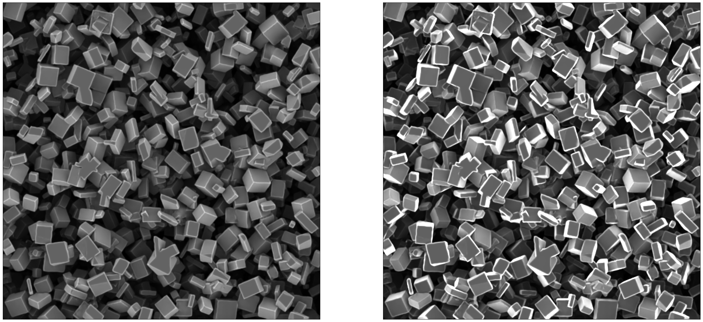

# Neural Focussed Ion Beam Simulator
This python package implements a surrogate model to approximately replicate the 
Monte-Carlo simulations performed to simulate scanning 
electron microscopy imaging. Our model accepts three-dimensional microstructure representations of porous 
materials in the form of lists of primitives. It converts them to 
a specific data representation suitable for a neural network. 
A convolutional architecture generates two-dimensional 
electron microscopy images in a single forward pass. The 
model performs well on arbitrary microstructures like 
systems of cubes, even though it was trained on structures 
consisting of spheres and cylinders only.



The method is described in detail in this publication:

[https://openreview.net/attachment?id=SwO84a6yA5&name=pdf]

## Citing
If you use our package, please cite this paper:
```
@inproceedings{pub15015,
    author = { Dahmen, Tim and Rottmayer, Niklas and Kronenberger, Markus and Schladitz, Katja and Redenbach, Claudia },
    title = {A Neural Model for High-Performance Scanning Electron Microscopy Image Simulation of Porous Materials},
    booktitle = {CVPR Workshop on Synthetic Data for Computer Vision (SynData4CV-2024)},
    address = {Seattle, OR, United States},
    year = {2024},
    month = {6},
    publisher = {CFV}
}
```

## Dependencies
The system uses py-build-cmake to build the python packages. It requires cmake => 3.18 an CUDA installation. 

## Usage Example
```Python
import neural_fib_se_bse
import numpy as np
import matplotlib.pyplot as plt

resolution     = 1024
simulator      = neural_fib_se_bse.SE_BSE_Simulator( output_size = (resolution,resolution) )
geometry_model = neural_fib_se_bse.CBooleanModel(image_size = np.array([resolution, resolution, resolution], dtype=int ),
                                                 particle_parameters = np.array([[5,35], [5,35], [5,35]],dtype=float),
                                                 particle_distribution = 'Uniform',
                                                 orientation = 'Uniform',
                                                 volume_density = 0.5,
                                                 particle_shape = 'Cuboid')
simulator.add_statistical_geometry( geometry_model )
se,bse = simulator.create_image()

figure, axis = plt.subplots( ncols=2, figsize=(32,16))

axis[0].imshow(se, cmap='gray', vmin=0, vmax=1)
axis[1].imshow(bse, cmap='gray', vmin=0, vmax=1)

plt.show()
```